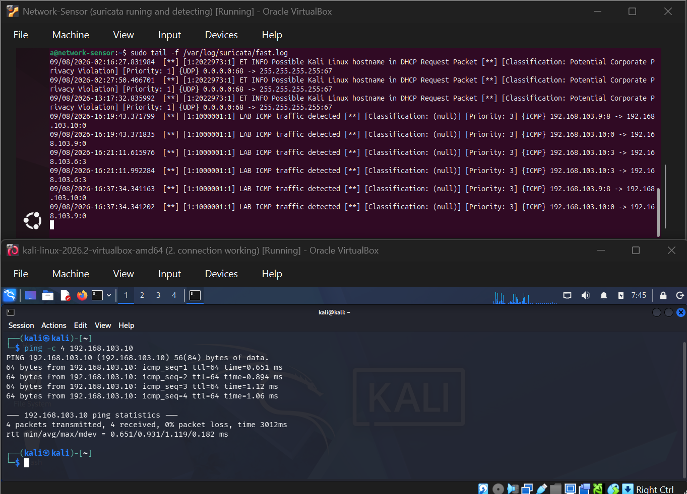
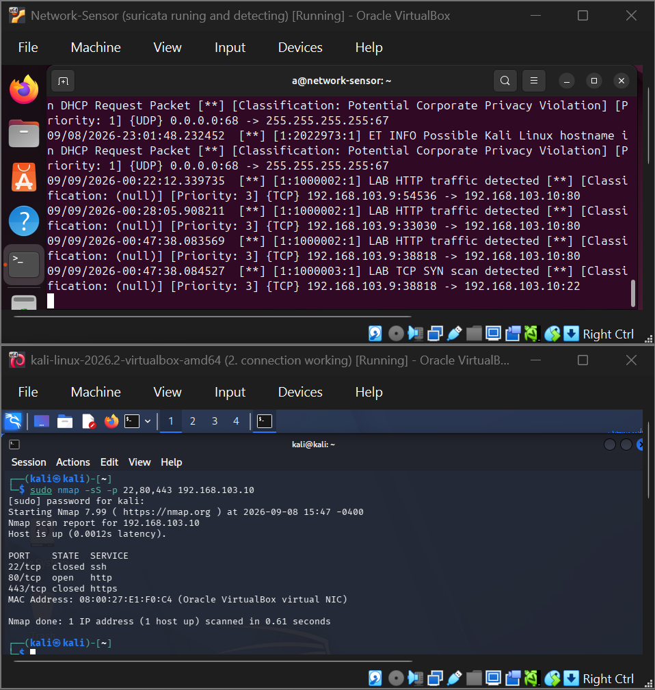
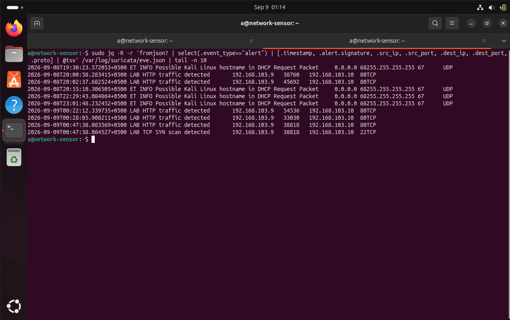
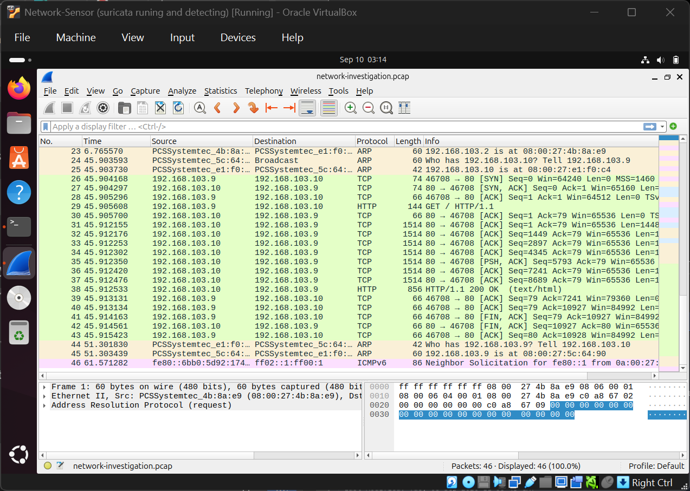
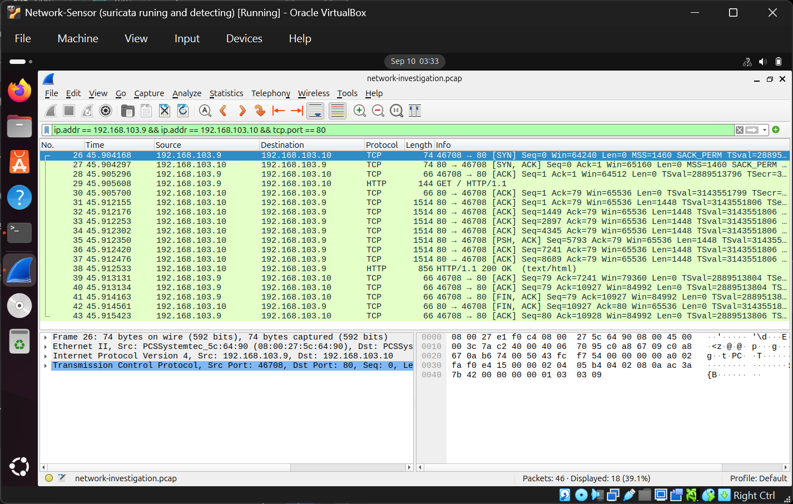
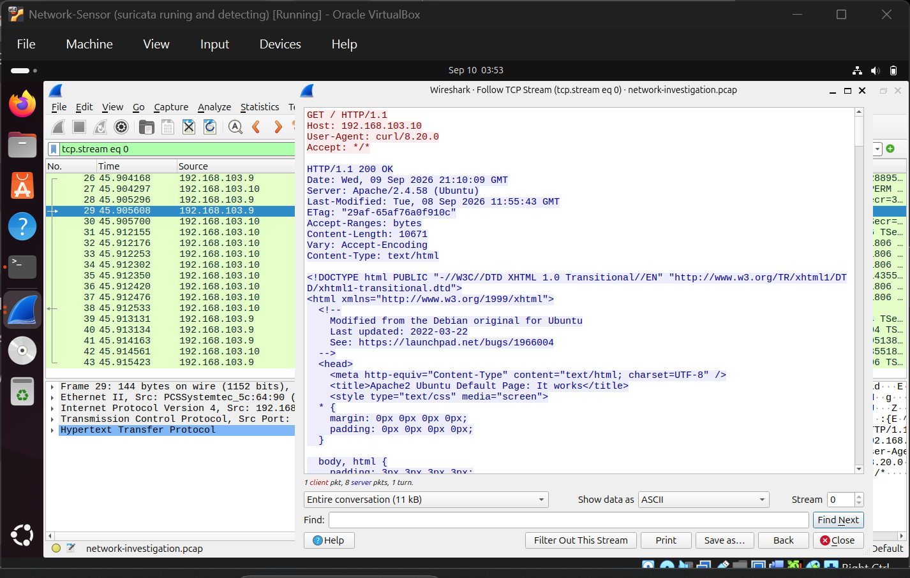
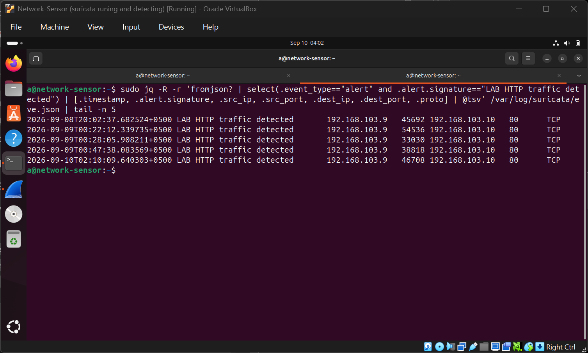
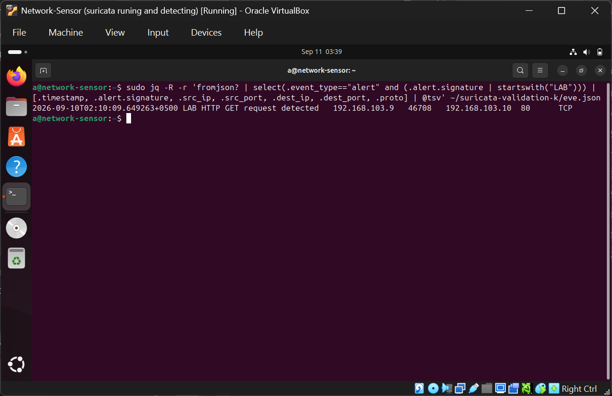
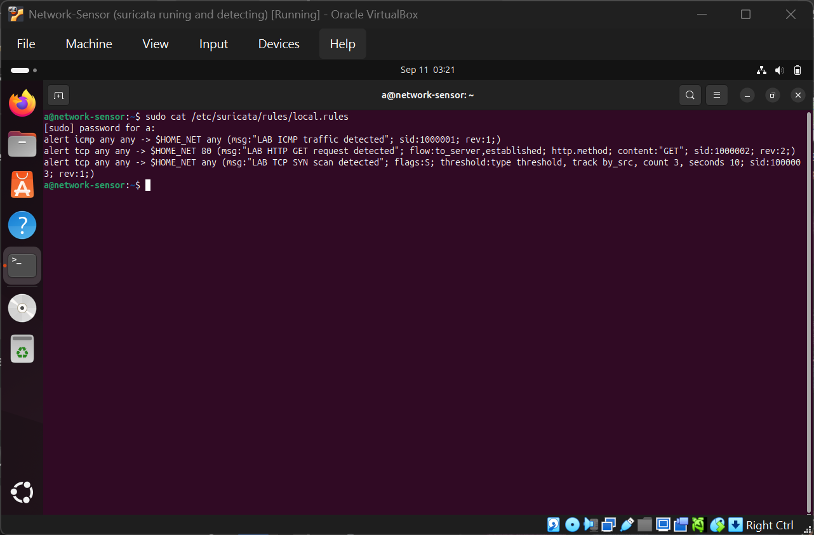

# Network Threat Detection & PCAP Investigation Lab

### From raw network traffic to validated security detections

A hands-on network security lab built to demonstrate the workflow of a SOC / network security analyst: **capture traffic, detect suspicious behavior, investigate packet-level evidence, correlate telemetry, tune detections, and validate the final logic against recorded traffic.**

 

---

## 🎯 What This Project Demonstrates

This is not simply a Suricata installation or a Wireshark walkthrough.

The project focuses on the **reasoning process behind network detection**.

A controlled network event is generated → captured → detected → investigated → correlated → tuned → replayed → validated.

**The result is a repeatable detection and investigation workflow rather than a collection of tool screenshots.**

### Core workflow

**Traffic Generation**  
↓  
**Network Capture**  
↓  
**IDS Detection**  
↓  
**Alert Investigation**  
↓  
**PCAP / Wireshark Analysis**  
↓  
**Alert-to-Packet Correlation**  
↓  
**Detection Tuning**  
↓  
**Offline PCAP Validation**  
↓  
**Analyst Assessment**

---

# 🔎 Project at a Glance

| Area | Implementation |
|---|---|
| **Attacker / Traffic Generator** | Kali Linux |
| **Network Sensor** | Ubuntu Linux |
| **IDS / Detection Engine** | Suricata 7.0.3 |
| **Packet Capture** | tcpdump |
| **Packet Investigation** | Wireshark |
| **HTTP Target** | Apache2 |
| **Reconnaissance Simulation** | Nmap SYN scan |
| **Custom Detection** | Suricata `local.rules` |
| **Structured Telemetry** | `eve.json` |
| **Detection Validation** | Offline PCAP replay |
| **Threat Framework** | MITRE ATT&CK |
| **Virtualization** | VirtualBox |
| **Lab Network** | `192.168.103.0/24` |

---

# 🏗️ Architecture

The lab consists of two virtual machines connected through an isolated VirtualBox Host-only network.

- **Kali — `192.168.103.9`**
  - Traffic generator
  - Controlled reconnaissance source
  - Generates ICMP, HTTP, and SYN-scan traffic

- **Ubuntu — `192.168.103.10`**
  - Suricata network sensor
  - Apache2 HTTP target
  - PCAP capture point
  - Monitored interface: `enp0s8`

The Ubuntu system intentionally performs both the **sensor** and **HTTP target** roles to keep the laboratory lightweight while maintaining a realistic detection workflow.

---

# ⚔️ Detection Scenarios

## 01 — ICMP Network Visibility

Controlled ICMP traffic was generated from Kali toward Ubuntu.

### Detection

`LAB ICMP traffic detected`

### Purpose

The first scenario verified that traffic generated inside the lab was actually visible on the monitored interface and could reach the Suricata detection pipeline.

### Security relevance

ICMP is not inherently malicious.

This test establishes **sensor visibility and detection-path functionality** before moving into reconnaissance and application-layer analysis.

---

## 02 — TCP SYN Reconnaissance

A controlled Nmap SYN scan was performed against the Ubuntu host:

    sudo nmap -sS -p 22,80,443 192.168.103.10

The scan tested multiple service ports and identified the HTTP service on port 80.

### Detection

`LAB TCP SYN scan detected`

### Detection logic

The custom signature detects TCP SYN activity and applies a threshold:

    alert tcp any any -> $HOME_NET any (msg:"LAB TCP SYN scan detected"; flags:S; threshold:type threshold, track by_src, count 3, seconds 10; sid:1000003; rev:1;)

### Why the threshold matters

A single SYN packet can be normal network behavior.

Requiring multiple matching packets within a short time window makes the detection more representative of repeated connection attempts associated with scanning activity.

### MITRE ATT&CK

**T1046 — Network Service Scanning**

---

# 🌐 03 — HTTP Application-Layer Investigation

Apache2 was used as the HTTP target on Ubuntu.

Kali generated an HTTP request:

    curl -v http://192.168.103.10/

The server returned:

    HTTP/1.1 200 OK

The traffic was captured and investigated at both the IDS and packet levels.

### What Wireshark revealed

The reconstructed TCP stream exposed:

    GET / HTTP/1.1
    Host: 192.168.103.10
    User-Agent: curl/8.20.0

The response included:

    HTTP/1.1 200 OK
    Server: Apache/2.4.58 (Ubuntu)
    Content-Type: text/html

This provided application-level context that would not be available from a simple TCP connection alert alone.

### MITRE ATT&CK

**T1071.001 — Web Protocols**

> The HTTP request itself is not classified as malicious. The mapping represents observed use of the web protocol.

---

# 🧠 Detection Engineering: From Broad to Specific

One of the most important parts of this project was **detection tuning**.

The first HTTP rule was intentionally broad:

    alert tcp any any -> 192.168.103.10 80 (msg:"LAB HTTP traffic detected"; sid:1000002; rev:1;)

This rule could identify TCP traffic directed toward port 80.

But there was a problem:

**Traffic going to port 80 does not necessarily prove that an HTTP request occurred.**

The rule was therefore refined.

### Final HTTP detection

    alert tcp any any -> $HOME_NET 80 (msg:"LAB HTTP GET request detected"; flow:to_server,established; http.method; content:"GET"; sid:1000002; rev:2;)

### What changed?

| Condition | Initial | Final |
|---|---:|---:|
| TCP | ✓ | ✓ |
| Destination port 80 | ✓ | ✓ |
| Established flow | — | ✓ |
| Client → server direction | — | ✓ |
| HTTP protocol inspection | — | ✓ |
| HTTP GET method | — | ✓ |

### Detection-engineering principle

The detection moved from:

> **"TCP traffic is going to port 80."**

to:

> **"An established client-to-server flow contains an HTTP GET request."**

That is a more meaningful detection condition because it adds **protocol context and behavioral specificity**.

---

# 📡 Network Capture

The HTTP traffic was captured directly from the monitored interface:

    sudo tcpdump -i enp0s8 -w ~/network-investigation.pcap

The resulting PCAP became the primary packet-level evidence source.

This enabled the same traffic to be examined independently of the live Suricata alert.

---

# 🔬 Packet Investigation

Wireshark was used to investigate the captured traffic.

A focused display filter was used:

    ip.addr == 192.168.103.9 && ip.addr == 192.168.103.10 && tcp.port == 80

The capture showed the TCP connection lifecycle and application data.

Following the TCP stream reconstructed the HTTP conversation.

### Investigation chain

**TCP connection**

→ **HTTP GET**

→ **Apache response**

→ **HTTP 200 OK**

→ **Returned content**

This allowed the alert to be investigated using actual packet evidence instead of treating the Suricata alert as the final answer.

---

# 🔗 Alert-to-PCAP Correlation

The Suricata HTTP alert contained:

    Source:       192.168.103.9:46708
    Destination:  192.168.103.10:80
    Protocol:     TCP

The same flow was identified in the Wireshark investigation.

### Correlation pivot

The source port:

`46708`

provided an additional flow-level correlation point.

### Reconstructed event

    Kali
    192.168.103.9:46708
             │
             │ TCP
             ▼
    Ubuntu
    192.168.103.10:80
             │
             ▼
       HTTP GET /
             │
             ▼
        HTTP 200 OK
             │
             ▼
       Suricata Alert

### Why this matters

An IDS alert provides detection telemetry.

A PCAP provides packet-level evidence.

Correlating the two increases confidence that the alert corresponds to the investigated network session.

---

# 🧪 Offline Detection Validation

The final tuned HTTP rule was tested against the recorded PCAP.

The captured traffic was replayed through Suricata:

    sudo suricata -r ~/network-investigation.pcap -c /etc/suricata/suricata.yaml -l ~/suricata-validation-k -k none

The replay successfully processed the captured traffic.

The final rule generated:

`LAB HTTP GET request detected`

with the same relevant flow:

    192.168.103.9:46708
            →
    192.168.103.10:80
            →
    TCP

### Why offline replay matters

The detection was not considered complete merely because it fired once during live traffic.

The PCAP provided a repeatable dataset that could be replayed against the final detection logic.

This creates a simple validation loop:

**Capture → Tune → Replay → Verify**

---

# 📊 Detection Results

| Scenario | Evidence Source | Detection | Outcome |
|---|---|---|---|
| ICMP | Ping + Suricata | `LAB ICMP traffic detected` | ✅ Detected |
| SYN reconnaissance | Nmap + Suricata | `LAB TCP SYN scan detected` | ✅ Detected |
| HTTP | curl + Suricata | `LAB HTTP GET request detected` | ✅ Detected |
| HTTP investigation | Wireshark | GET + 200 OK reconstructed | ✅ Confirmed |
| Alert correlation | Suricata + Wireshark | Matching flow metadata | ✅ Correlated |
| Tuned HTTP | PCAP replay | Final HTTP GET signature | ✅ Validated |

---

# 🧩 MITRE ATT&CK Mapping

Only behaviors directly supported by the collected evidence were mapped.

| Technique | Observed Activity | Supporting Evidence |
|---|---|---|
| **T1046 — Network Service Scanning** | Controlled Nmap SYN scan | Nmap results + Suricata SYN detection |
| **T1071.001 — Web Protocols** | HTTP communication | Wireshark HTTP stream + Suricata detection |

The project deliberately avoids over-mapping ordinary network behavior to ATT&CK techniques without supporting evidence.

---

# 🕵️ Analyst Perspective

A detection alert is **not automatically proof of compromise**.

In a real SOC environment, the analyst would establish context before escalating.

### Investigation workflow

1. Identify the source host.
2. Determine whether the activity is authorized.
3. Review related network activity.
4. Identify destination services.
5. Look for exploitation or follow-on behavior.
6. Correlate with endpoint and authentication telemetry where available.
7. Determine whether the activity is expected, suspicious, or malicious.
8. Apply the organization's incident-response process when appropriate.
9. Tune the detection if legitimate activity is generating unnecessary noise.

The project therefore emphasizes the distinction between:

**Detection ≠ Verdict**

An alert is a starting point for investigation.

---

# 📸 Evidence Gallery

### Network visibility & reconnaissance

| ICMP Detection | SYN Scan Detection |
|---|---|
|  |  |

### Suricata telemetry & packet capture

| Suricata Alerts | PCAP Overview |
|---|---|
|  |  |

### HTTP investigation

| HTTP Traffic | TCP Stream |
|---|---|
|  |  |

### Correlation & validation

| Alert ↔ Wireshark Correlation | Tuned Detection |
|---|---|
|  |  |

### Final detection logic

---

# 🛠️ Technology Stack

### Detection

- Suricata 7.0.3
- Custom Suricata signatures
- `eve.json`
- Threshold-based detection
- HTTP protocol inspection

### Network Analysis

- Wireshark
- tcpdump
- PCAP investigation
- TCP stream reconstruction

### Traffic Generation

- Kali Linux
- Nmap
- curl
- ping

### Target / Services

- Ubuntu Linux
- Apache2

### Environment

- VirtualBox
- Host-only networking
- Isolated laboratory topology

### Security Framework

- MITRE ATT&CK

---

# 📁 Repository Structure

    network-threat-detection-lab/
    │
    ├── README.md
    │
    ├── architecture/
    │   └── network-threat-detection-architecture.png
    │
    ├── rules/
    │   └── local.rules
    │
    ├── screenshots/
    │   ├── 01-icmp-detection.png
    │   ├── 02-syn-scan-detection.png
    │   ├── 03-suricata-alerts.png
    │   ├── 04-pcap-overview.png
    │   ├── 05-http-traffic-analysis.png
    │   ├── 06-http-tcp-stream.png
    │   ├── 07-suricata-wireshark-correlation.png
    │   ├── 08-tuned-http-detection.png
    │   └── 09-final-detection-rules.png
    │
    └── docs/
        └── detection-analysis.md

---

# 📚 Technical Documentation

The README provides the project overview and investigation story.

For the deeper technical analysis, see:

### [Detection Analysis](docs/detection-analysis.md)

Detailed coverage includes:

- Lab topology
- Suricata configuration
- Detection logic
- Rule design
- Detection tuning
- `eve.json` analysis
- PCAP investigation
- Wireshark analysis
- Alert-to-PCAP correlation
- Offline validation
- Checksum/offloading considerations
- MITRE ATT&CK mapping
- Limitations
- SOC response methodology
- Reproducibility commands

### [Suricata Rules](rules/local.rules)

Contains the final custom detection signatures used in the lab.

---

# ⚠️ Limitations

### Sensor visibility

Suricata can only detect traffic that is visible on its monitored interface.

### Signature-based detection

Broad signatures can generate false positives. Detection quality depends on appropriate conditions and tuning.

### Encrypted traffic

HTTPS encryption limits straightforward inspection of application-layer information such as HTTP methods and request contents.

### Controlled environment

All activity was intentionally generated inside an isolated laboratory.

The results demonstrate detection and investigation techniques rather than evidence of a real-world compromise.

---

# 💡 Key Lessons

### 01 — Visibility comes before detection

A detection cannot work reliably if the sensor cannot see the traffic.

### 02 — Ports do not tell the whole story

A TCP connection to port 80 does not necessarily prove HTTP behavior.

### 03 — Protocol-aware detection adds context

Suricata's HTTP inspection allowed the final rule to detect the HTTP method rather than relying solely on the destination port.

### 04 — Alerts need investigation

The Suricata alert became more useful when correlated with packet-level evidence from Wireshark.

### 05 — Detection tuning matters

A rule that fires is not automatically a high-quality detection.

### 06 — PCAPs enable repeatable validation

Recorded traffic makes it possible to replay known behavior and test detection logic after changes.

---

# 🏁 Final Outcome

This project demonstrates a complete network threat-detection workflow:

**Generate → Capture → Detect → Investigate → Correlate → Tune → Validate**

The strongest outcome is not the use of any individual security tool.

It is the ability to take a network event, examine the underlying evidence, understand what the detection actually proves, improve the detection logic, and validate the result against recorded traffic.

That workflow is directly relevant to practical work involving:

- Network Detection & Response
- SOC monitoring
- IDS/IPS operations
- Network security analysis
- Detection engineering
- PCAP investigation
- Threat hunting
- Security operations

---

## 🔐 Disclaimer

This project was conducted in an isolated laboratory environment for educational and defensive cybersecurity purposes.

All network activity was intentionally generated and controlled within the lab.
