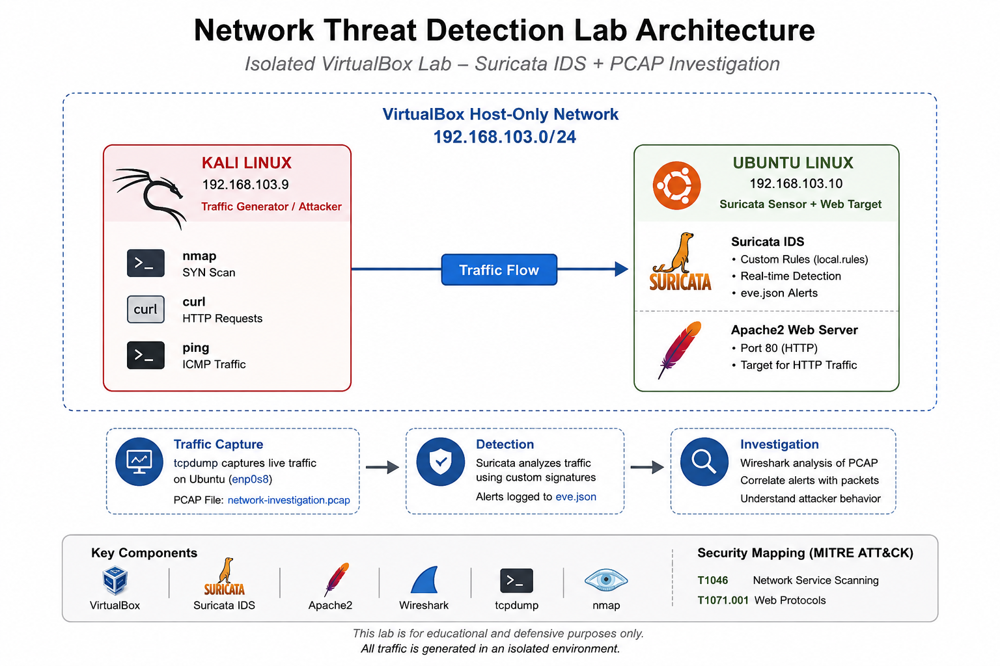

# Network Threat Detection & PCAP Investigation Lab

> A practical network security lab demonstrating packet capture, protocol analysis, IDS detection, alert investigation, detection tuning, and PCAP-based validation.



---

## 🎯 Project Overview

This project simulates a small network monitoring environment where network traffic is generated, captured, analyzed, detected, and investigated from a security analyst's perspective.

The lab combines **Wireshark** for packet-level investigation with **Suricata IDS** for network detection.

Rather than simply generating alerts, the project demonstrates the complete investigation workflow:

**Network Traffic → Packet Capture → Protocol Analysis → Detection → Investigation → Correlation → Detection Tuning → Validation → Analyst Conclusion**

---

## 🧠 What This Project Demonstrates

- Network traffic analysis
- TCP/IP and HTTP protocol investigation
- PCAP analysis with Wireshark
- Network IDS deployment with Suricata
- Custom Suricata detection rules
- Reconnaissance detection
- HTTP traffic detection
- Structured alert investigation using `eve.json`
- Alert-to-PCAP correlation
- Detection tuning and validation
- MITRE ATT&CK mapping
- SOC-style investigation and response recommendations

---

## 🏗️ Lab Architecture

The lab uses two virtual machines connected through a VirtualBox Host-only network.

| Host | Role | IP Address |
|---|---|---|
| Kali Linux | Attacker / Traffic Generator | `192.168.103.9` |
| Ubuntu Linux | Network Sensor + Suricata + Apache | `192.168.103.10` |

**Network:** `192.168.103.0/24`  
**Monitored interface:** `enp0s8`

Kali generates controlled network activity against the Ubuntu host.

Ubuntu simultaneously provides:

- Suricata network monitoring
- Apache HTTP service
- PCAP capture
- Alert generation

---

## 🛠️ Technologies

| Technology | Purpose |
|---|---|
| Kali Linux | Traffic generation and reconnaissance |
| Ubuntu Linux | Network sensor and HTTP target |
| Suricata 7.0.3 | Network IDS and detection engine |
| Wireshark | Packet-level investigation |
| tcpdump | PCAP capture |
| Apache2 | HTTP target service |
| VirtualBox | Virtualized lab environment |
| MITRE ATT&CK | Adversary behavior mapping |

---

## 🔬 Investigation Methodology

The investigation followed a repeatable SOC-style workflow:

1. Generate controlled network traffic.
2. Capture network packets.
3. Analyze protocols and communication flows.
4. Identify suspicious or security-relevant behavior.
5. Detect activity using Suricata.
6. Investigate structured IDS alerts.
7. Correlate IDS alerts with packet-level evidence.
8. Tune an overly broad detection.
9. Re-test the detection against the captured PCAP.
10. Map relevant behaviors to MITRE ATT&CK.
11. Document findings and response recommendations.

---

# 🚨 Detection Scenarios

## 1. ICMP Traffic Detection

Controlled ICMP traffic was generated from Kali toward the Ubuntu sensor.

Suricata successfully detected the traffic using a custom ICMP rule.

**Evidence:** `01-icmp-detection.png`

### Detection

```text
LAB ICMP traffic detected
